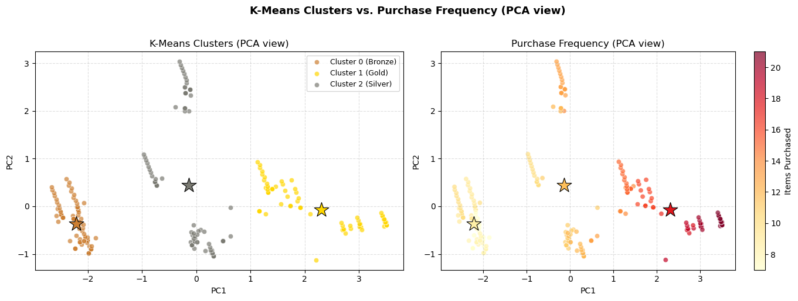

# Customer Behavior E-commerce 

Analyzes customers' behavior on an e-commerce platform based on factors such as age, total spending, items purchased, average rating, and days since last purchased. 

Conducted K-means on Customer Behavior E-commerce Dataset to predict membership status basaed on said factors and compare its relationship to purchase frequency. 

## Context 
This project helps the e-commerce platform to segment its customers into meaningful groups, aka membership tiers, based on their interactions with the platform and create personalized benefits and reward systems for each tier. 

## What I did 
*Dataset*: [E-commerce Customer Behavior by Laksika Tharmalingam](https://www.kaggle.com/datasets/uom190346a/e-commerce-customer-behavior-dataset)

Conducted K-means cluster to find groupings on membership tiers based on features such as age, total spending, number of items purchased, average rating, and days since last purchased. Identified membership groupings similar to purchasing behaviors for customer segmentation analysis. 

## Results and Findings 

- those who interact least with the platform are the lowest tier (bronze)
- those who interact more with the platform are the highest tier (gold) 

Strong correlation with clusters and purchasing frequency 
- High purchasing frequency - Gold membership tier (highest)
- Middle purchasing frequency - Silver membership tier
- Low purchasing frequency - Bronze membership tier (lowest)

### Required Libraries 
- numpy
- pandas
- matplotlib
- scikit-learn
